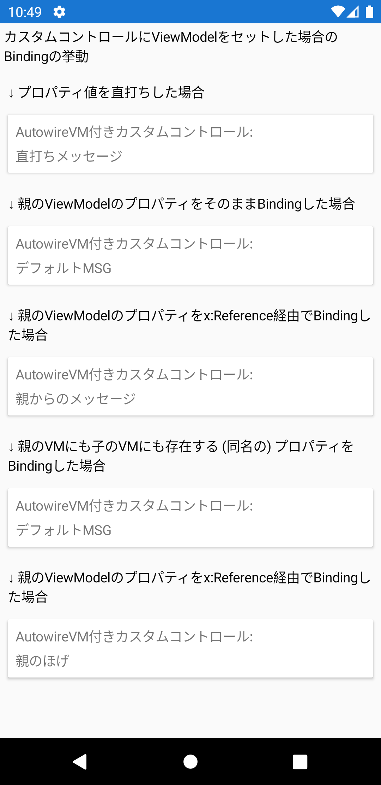
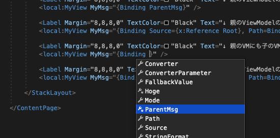

# CustomControlVMTest

Xamarin.FormsにおいてカスタムコントロールにViewModelを設定した際のBindingの挙動の検証

## 状況

* `MyView` というカスタムコントロールを作成
* `MyView` に `MyMsg` というBindablePropertyを作成
* `MyView` に対して `MyViewModel` というViewModelを作成
* `MyView` に `prism:ViewModelLocator.AutowireViewModel="True"` を設定
* `MyView` を `MyPage` に配置
* 配置した `MyView` の `MyMsg` に対して `<local:MyView MyMsg="{Binding ParentMsg}" />` というように親のVMの `ParentMsg` をバインド
* 正しくBindingされていないように見える ← これの調査

## 結論

`x:Reference` で親を指定し、親のViewModel (BindingContext) 経由でPathを指定

↓ [XAMLコード](https://github.com/aridai/CustomControlVMTest/blob/master/CustomControlVMTest/MainPage.xaml#L23)  
```xaml
<local:MyView MyMsg="{Binding Source={x:Reference Root}, Path=BindingContext.ParentMsg}" />
```

## 検証コード

↓ [XAMLコード](https://github.com/aridai/CustomControlVMTest/blob/master/CustomControlVMTest/MainPage.xaml)  
```xaml
<StackLayout Orientation="Vertical">

    <Label Margin="4" TextColor="Black" Text="カスタムコントロールにViewModelをセットした場合のBindingの挙動" />

    <Label Margin="8,8,8,0" TextColor="Black" Text="↓ プロパティ値を直打ちした場合" />
    <local:MyView MyMsg="直打ちメッセージ" />

    <Label Margin="8,8,8,0" TextColor="Black" Text="↓ 親のViewModelのプロパティをそのままBindingした場合" />
    <local:MyView MyMsg="{Binding ParentMsg}" />

    <Label Margin="8,8,8,0" TextColor="Black" Text="↓ 親のViewModelのプロパティをx:Reference経由でBindingした場合" />
    <local:MyView MyMsg="{Binding Source={x:Reference Root}, Path=BindingContext.ParentMsg}" />

    <Label Margin="8,8,8,0" TextColor="Black" Text="↓ 親のVMにも子のVMにも存在する (同名の) プロパティをBindingした場合" />
    <local:MyView MyMsg="{Binding Hoge}" />

    <Label Margin="8,8,8,0" TextColor="Black" Text="↓ 親のViewModelのプロパティをx:Reference経由でBindingした場合" />
    <local:MyView MyMsg="{Binding Source={x:Reference Root}, Path=BindingContext.Hoge}" />

</StackLayout>
```

↓ アプリ実行結果  
</img>

## 注意点

インテリセンスのサジェスト内容自体は親 (`MainPage`) のBindingContext (`MainPageViewModel`) のものであるため、  
`MyMsg="{Binding ParentMsg}"` という記述が正しいかのように見えてしまう。

↓ インテリセンスのサジェスト  
</img>
